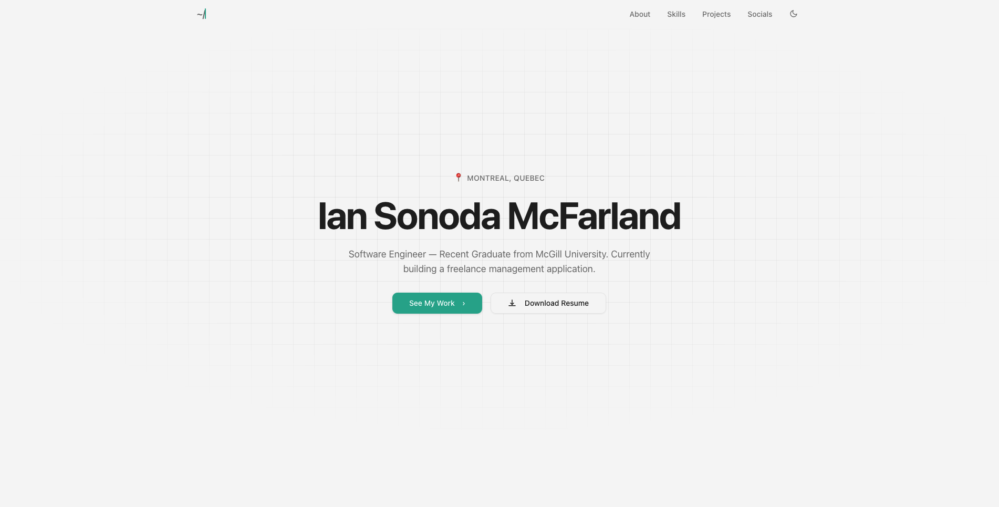
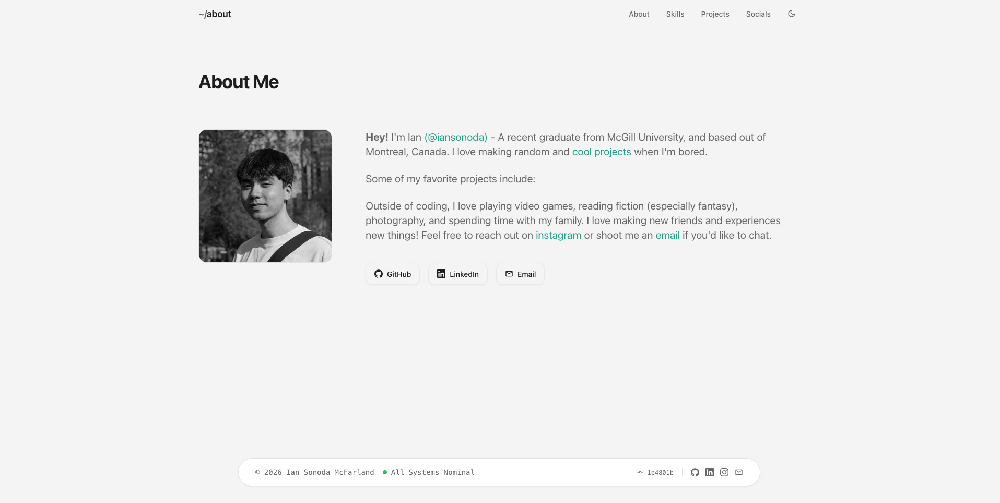
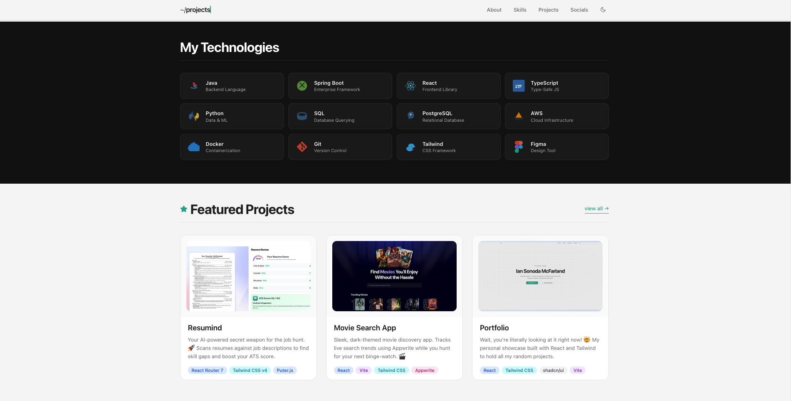
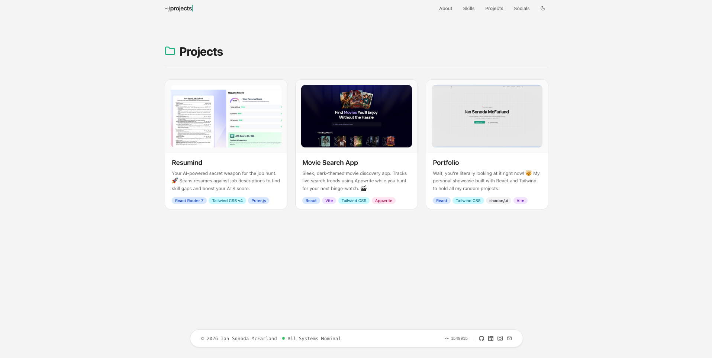
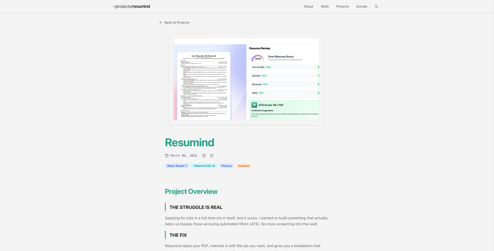
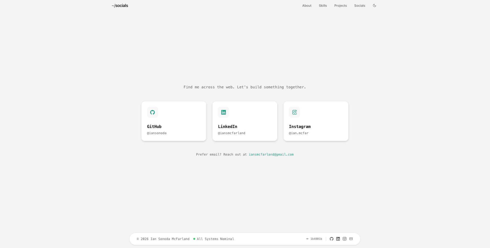

# 🌐 Ian Sonoda McFarland - Personal Portfolio

Welcome to my personal slice of the internet! This is a modern, responsive portfolio website designed to showcase my journey as a Software Engineer, my projects, and the technical skills I've picked up along the way.

## Live Site

The portfolio is deployed at [iansonoda.vercel.app](https://iansonoda.vercel.app).

## ✨ Preview

  
  
<em>The clean, minimalistic hero section.</em>

   
  

    
    
  

  
<em>Comprehensive About and Skills sections.</em>

   
  
  
<em>Dynamic project showcase with live data.</em>

   
  
  
<em>Deep dives into every project with custom title styling.</em>

   
  
  
<em>Connect with me through various platforms.</em>

## 🚀 Why This Project?

I built this portfolio to replace basic resumes with a living, breathing demonstration of my work. It's designed to be:

- **Fast:** Lightning-fast loads powered by Vite and React.
- **Sleek:** Minimalistic dark-mode aesthetic using Tailwind CSS.
- **Maintainable:** All content is driven by a single JSON "Source of Truth," making updates a breeze.

## 🛠️ Tech Stack

- **Framework:** [React](https://reactjs.org/) (Hooks, Context)
- **Navigation:** [React Router 7](https://reactrouter.com/)
- **Bundler:** [Vite](https://vitejs.dev/)
- **Styling:** [Tailwind CSS](https://tailwindcss.com/)
- **UI Components:** [shadcn/ui](https://ui.shadcn.com/) (Radix UI)
- **Icons:** [Lucide React](https://lucide.dev/)
- **Animation:** [tailwindcss-animate](https://github.com/jamiebuilds/tailwindcss-animate)
- **Deployment:** [Vercel](https://vercel.com/) at [iansonoda.vercel.app](https://iansonoda.vercel.app)

## 📄 Content Management

The entire portfolio is data-driven. To update your info, bio, skills, or projects, simply edit:
`src/data/portfolio.json`

## 📫 Let's Connect!

- **Email:** [iansmcfarland@gmail.com](mailto:iansmcfarland@gmail.com)
- **LinkedIn:** [linkedin.com/in/iansmcfarland](https://linkedin.com/in/iansmcfarland)
- **GitHub:** [@iansonoda](https://github.com/iansonoda)
- **Instagram:** [@ian.mcfar](https://instagram.com/ian.mcfar)

---

Built with ❤️ while procrastinating at McGill. 🎓
